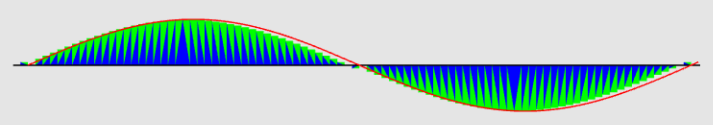
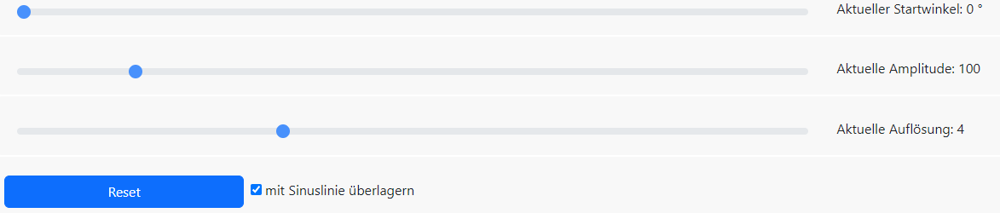

---

**Graphical Visualisation Technologies**

**Dozent: Prof. Dr. Felix Gers (Berliner Hochschule für Technik)**

**Studiengang Medieninformatik Online MA, Wintersemester 2022/23**

**University of Applied Sciences Emden/Leer, Faculty of Technology, Department of Electrical Engineering and
Informatics**

---

### Einsendeaufgabe EA3 : 2D-Geometrie aus farbigen Dreiecken

[zur Webseite](https://gvt.ckitte.de/ea3/)

Im Rahmen der dritten Einsendeaufgabe soll eine 2D-Geometrie aus Dreiecken erzeugt und mittels WebGL dargestellt werden.

Für meine Abgabe stelle ich eine Sinuswelle dar. Die Welle wird hierbei durch Säulen dargestellt,
welche jeweils mit Hilfe zweier Dreiecke erzeugt werden. Um dies zu verdeutlichen, werden die zwei
Dreiecke unterschiedlich eingefärbt.

Die Sinuswelle kann anhand von drei Parametern verändert werden. Mit Startwinkel wird der erste Winkel festgelegt, mit
Amplitude erfolgt eine Skalierung des Funktionswertes. Die Auflösung ändert die Breite der verwendeten Balken und somit
die Auflösung.

Der Reset Button stellt die anfänglichen Werte wieder her. Mit Hilfe der Checkbox kann eine rote Sinuskurve über die
Ausgabe gelegt werden.

Die Nulllinie wird durch einen schwarzen Strich angezeigt. Seine Punkte und Farben werden in einen separaten Array
gehalten, was dynamisch nach dem Zeichnen der ersten Ausgabe (Dreiecke) an das interne WebGL Vertexbuffer angehangen
wird. Eine erneute Ausgabe der Punkte fügt die Linie der Ausgabe hinzu.

Analog zur Mittellinie wird auch die Sinuswelle in einem eigenen Array definiert. Der Wert der Checkbox steuert, ob auch
diese Werte zur Ausgabe kommen.

Als Startseite dient wie üblich eine **index.html**. Die Datei **main.css** enthält alle benötigten Klassen, um die Grafik
einfach einzubinden. In der Datei **layout.css** wird das Layout der Webseite selbst festgelegt. Daneben kommt Bootstrap
für die Buttons zum Einsatz.

Die Logik verteilt sich auf mehrere JavaScript Dateien, welche von **main.js** genutzt werden. WebGL selbst und der
Shadercode befinden sich in den Dateien **webglconfig.js** und **shader.js**. In der Datei **configure.js** werden die
Programmeinstellungen gehalten. Die Datei **extendedvertexarray.js** handelt Arrayfunktionen und die Arrays selbst.

Der Canvas als zentrales Ausgabeobjekt wurde in der **index.html** angelegt und mit einer fixen Breite von 1000px
belegt. Alle anderen Einstellungen erfolgen über CSS.
